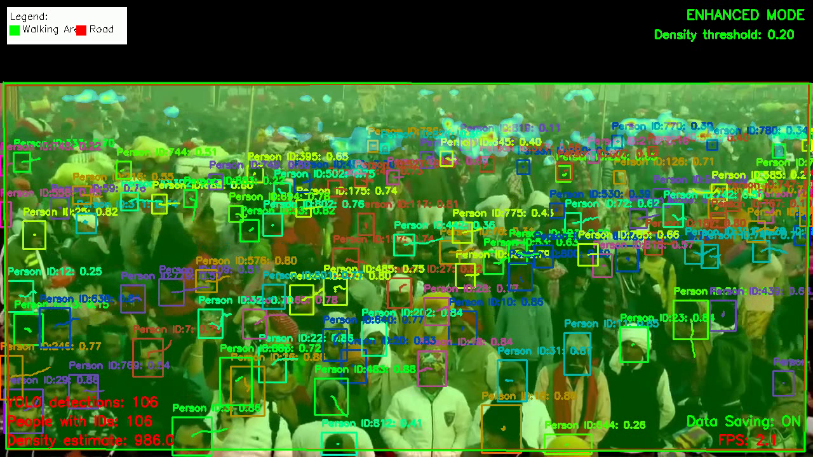
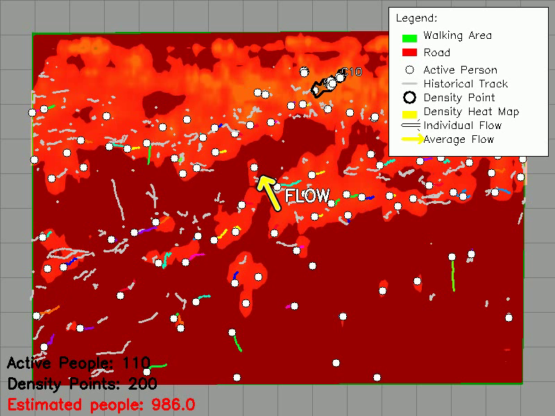
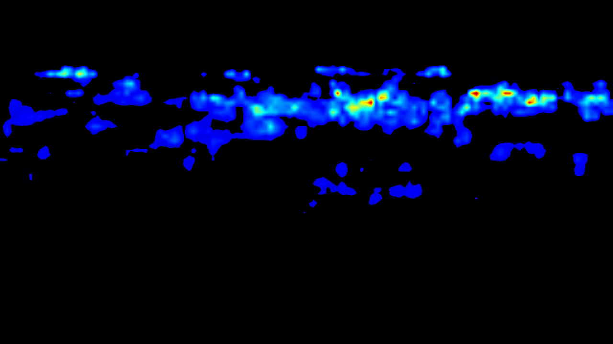

# BhedChaal (CrowdFlow-AI) GROUP-07


A crowd analysis and simulation system for safety monitoring and stampede prevention.

## Overview

BhedChaal is a comprehensive crowd analysis toolkit that combines computer vision, density estimation, anomaly detection, and crowd simulation to help understand, monitor, and predict crowd behavior in various settings. The system is designed to assist in safety planning and real-time monitoring of crowded environments to prevent incidents such as stampedes and bottlenecks.

## System Workflow

The BhedChaal system follows a sophisticated workflow:

1. **Input Processing**:
   - CCTV video footage is input to the system
   - Processed through ffmpeg for standardization
   - Enhanced using Real srGAN for improved resolution

2. **Parallel Processing Streams**:
   - **Person Detection & Tracking**: Uses YOLOv11 Face model fine-tuned for head detection
   - **Area Management**: Defines walking areas and road areas for analysis
   - **Density Estimation**: Implements CSRNet to estimate crowd density

3. **Intermediate Processing**:
   - Person detection feeds into original view visualization and people count estimation
   - Both person detection and density estimation contribute to perspective transformation
   - Area definitions are used to map coordinate systems between views

4. **Advanced Visualization**:
   - **Original View**: Shows detection results on the original CCTV footage
   - **Top-Down View**: Transforms the perspective to provide overhead visualization
   - Both views can display people tracking and density information

5. **Analysis Components**:
   - **Anomaly Detector**: Processes top view data to identify abnormal crowd movements
   - **Stampede Detection**: Analyzes anomalies to identify potential stampede conditions

6. **Simulation**:
   - Data from top view and density estimation is exported as JSON files
   - Feeds into Panic Simulation module that uses social force models in pygame
   - Simulates crowd behavior under normal and panic conditions


# Key Features

## Enhanced Video Processing
- SRGAN Frame Enhancement for improved detail in low-resolution footage
- Video standardization for consistent analysis


## Spatial Transformation
- CCTV to top-view conversion with interactive calibration
- Save and reuse perspective points across sessions


## Detection and Tracking
- Person detection with YOLOv11 Fcae detection finetuned specifically for face detection
- Multi-object tracking with persistent IDs
- Movement vector analysis
  
  

## Density Analysis
- Crowd density estimation using CSRNet
- Hybrid detection for accurate crowd measurement
- Heat map visualization of crowd density

## Anomaly Detection
- Counter-flow detection for identifying unusual movements
- Automatic bottleneck identification
- Stampede early warning system
- Anomaly persistence tracking
  
  


## Physics-Based Crowd Simulation
- Social force model for realistic crowd dynamics
- Panic propagation modeling
- Agent-based individual simulation
- Fluid-like crowd approximation for emergency scenarios
  


## Interactive Controls
- Multi-view display (original, top-view, density)
- Dynamic panic triggering through interactive interface
- Customizable simulation parameters
- Real-time analytics dashboard

## Some more Screenshots and Visualizations

Here are some examples of BhedChaal's output:

| Description | Image |
|-------------|-------|
| Original CCTV View with Detection |  |
| Top-Down Transformed View |  |
| Density Heatmap |  |


## Requirements

- Python 3.7+
- OpenCV
- PyTorch
- NumPy
- Pygame (for simulation)
- ffmpeg (for video preprocessing)
- CUDA-compatible GPU (recommended)

## Installation

1. Clone this repository
   ```bash
   git clone https://github.com/username/BhedChaal.git
   cd BhedChaal
   ```

2. Install required dependencies:
   ```bash
   pip install opencv-python torch numpy pygame ultralytics ffmpeg-python
   ```

3. Download pre-trained models:
   - The YOLOv8 weights will be automatically downloaded when first run
   - Download CSRNet weights and place in the project root directory:
     ```bash
     # For CSRNet weights
     wget -O weights.pth https://example.com/csrnet_weights.pth
     # For fine-tuned detection model
     wget -O best_re_final.pt https://example.com/detection_model.pt
     ```

## Assets Folder

The `assets` folder contains images used in the README and documentation:

```
BhedChaal/
├── assets/
│   ├── system_overview.png
│   ├── workflow_diagram.png
│   ├── original_view.png
│   ├── top_view.png
│   ├── density_map.png
│   └── simulation.png
└── ...
```

### Adding Images to README

To add images to the README from the assets folder, use the following Markdown syntax:

```markdown

```

For a table of images:

```markdown
| Description | Image |
|-------------|-------|
| Image 1 |  |
| Image 2 |  |
```

## Executable Code Examples

### Basic Video Processing

```python
from video_preprocessor import preprocess_video

# Preprocess a video file
processed_video = preprocess_video(
    input_path="your_video.mp4",
    target_resolution=(1280, 720)
)
print(f"Processed video saved to {processed_video}")
```

### Person Detection and Tracking

```python
import cv2
from person_detection import PersonDetector

# Initialize the detector
detector = PersonDetector(model_size='x')

# Process a video frame-by-frame
video = cv2.VideoCapture("your_video.mp4")
while True:
    ret, frame = video.read()
    if not ret:
        break
        
    # Detect and track people
    detections, annotated_frame = detector.detect(frame)
    
    # Display result
    cv2.imshow("Detections", annotated_frame)
    if cv2.waitKey(1) & 0xFF == ord('q'):
        break
        
video.release()
cv2.destroyAllWindows()
```

### Crowd Density Estimation

```python
import cv2
import numpy as np
from density_estimation import CrowdDensityEstimator

# Initialize density estimator
estimator = CrowdDensityEstimator(model_path="weights.pth")

# Process a video frame-by-frame
video = cv2.VideoCapture("your_video.mp4")
while True:
    ret, frame = video.read()
    if not ret:
        break
        
    # Estimate crowd density
    density_map, count, colorized_density = estimator.estimate_density(frame)
    
    # Overlay density on the original frame
    alpha = 0.6
    overlay = cv2.addWeighted(frame, 1-alpha, colorized_density, alpha, 0)
    cv2.putText(overlay, f"Count: {count}", (20, 40), cv2.FONT_HERSHEY_SIMPLEX, 
                1, (0, 255, 0), 2)
    
    # Display result
    cv2.imshow("Crowd Density", overlay)
    if cv2.waitKey(1) & 0xFF == ord('q'):
        break
        
video.release()
cv2.destroyAllWindows()
```

### Running the Complete Pipeline

```python
import main
import sys

# Run with default settings (using japan.mp4 as input)
sys.argv = ["main.py"]
main.main()

# Run with custom parameters
sys.argv = [
    "main.py",
    "--video-path", "your_video.mp4",
    "--output", "output_video.mp4",
    "--enhanced",
    "--density-threshold", "0.15",
    "--max-points", "300"
]
main.main()

# Run with panic simulation
sys.argv = [
    "main.py",
    "-w", "weights.pth",
    "-o", "output_videos",
    "-v", "14.mp4",
    "-e",
    "--anomaly-threshold", "15",
    "--stampede-threshold", "20",
    "--run-panic-sim"
]
main.main()
```

### Custom Panic Simulation

```python
import sys
from panic_simulation import PanicSimulation

# Create simulation instance
simulation = PanicSimulation()

# Load data from a processed video
video_path = "your_video.mp4"
if simulation.load_data_from_video(video_path):
    # Auto-record the simulation
    simulation.start_recording(duration=60)
    
    # Run the simulation
    simulation.run_simulation()
    
    # Save results
    simulation.save_results(output_dir="simulation_results")
else:
    print(f"Failed to load data from {video_path}")
```

## Usage

### Basic Usage

```bash
python main.py --video-path your_video.mp4 --output output_video.mp4
```

### Enhanced Visualization

```bash
python main.py --video-path your_video.mp4 --output output_video.mp4 --enhanced
```

### Run with Panic Simulation

```bash
python main.py -w weights.pth -o output_videos -v 14.mp4 -e --anomaly-threshold 15 --stampede-threshold 20 --run-panic-sim
```

This command:
- Specifies `weights.pth` as the CSRNet model weights
- Sets `output_videos` as the output directory
- Uses `14.mp4` as the input video
- Enables enhanced visualization with `-e`
- Lowers the anomaly threshold to 15 (default: 30)
- Lowers the stampede threshold to 20 (default: 35)
- Runs the panic simulation after processing

### Command Line Options

- `--video-path, -v`: Path to input video file
- `--output, -o`: Path for output file
- `--calibration, -c`: Path to calibration image
- `--model-size, -m`: YOLOv8 model size (n, s, m, l, x)
- `--no-tracking`: Disable person tracking
- `--enhanced, -e`: Use enhanced visualization with density points
- `--density-threshold`: Threshold for density-based data points (default: 0.2)
- `--max-points`: Maximum number of density points (default: 200)
- `--no-preprocess`: Disable video preprocessing/standardization
- `--anomaly-threshold`: Threshold for bottleneck detection (default: 30)
- `--stampede-threshold`: Threshold for stampede warning (default: 35)
- `--max-bottlenecks`: Maximum number of bottlenecks to identify (default: 3)
- `--run-panic-sim`: Launch panic/stampede simulation after video processing
- `--auto-record`: Automatically start recording animation when panic simulation begins
- `--record-duration`: Duration of auto-recording in seconds (default: 60)

## Components

### Video Preprocessor
Standardizes video input for consistent analysis using ffmpeg and Real srGAN for super-resolution.

### Person Detection
Uses YOLOv11 Face model, fine-tuned for head detection and tracking in video footage.

### Area Manager
Manages the definition of walking areas and road areas for analysis and visualization.

### Density Estimation
Implements CSRNet for crowd density estimation based on the processed video input.

### Perspective Transformation
Converts between original camera view and top-down view for improved analysis.

### Anomaly Detection
Identifies unusual crowd movements and potential hazards, leading to stampede detection.

### Panic Simulation
Implements social force model using pygame to simulate crowd behavior during panic situations.

### Visualization
Provides multiple visualization modes including:
- Top-view perspective transformation
- Density heat maps
- Movement flow visualization
- Bottleneck detection

## Panic Simulation

The panic simulation module allows you to:
- Simulate crowd behavior under normal and panic conditions
- Inject panic at specific locations to study spread patterns
- Visualize density waves and crowd movements
- Test different exit and obstacle configurations
- Record simulations for later analysis

## License

This project is released under the MIT License. See the LICENSE file for more details.

## Citation

If you use this code in your research, please cite:

```
@software{BhedChaal,
  author = {Project Contributors},
  title = {BhedChaal: Crowd Analysis and Simulation System},
  year = {2023},
  url = {https://github.com/username/BhedChaal}
}
```
